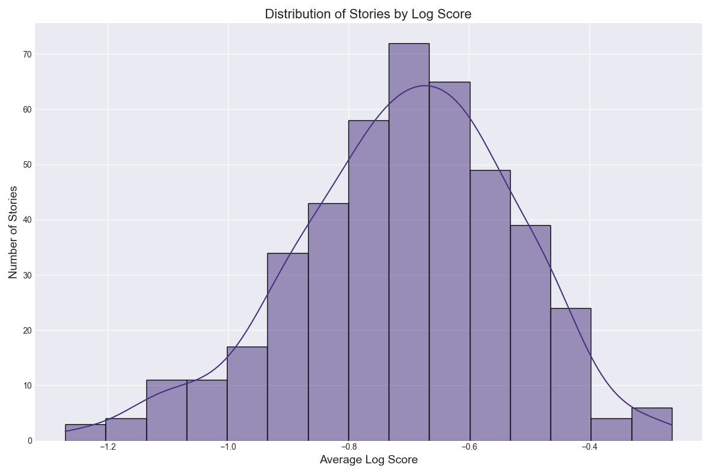
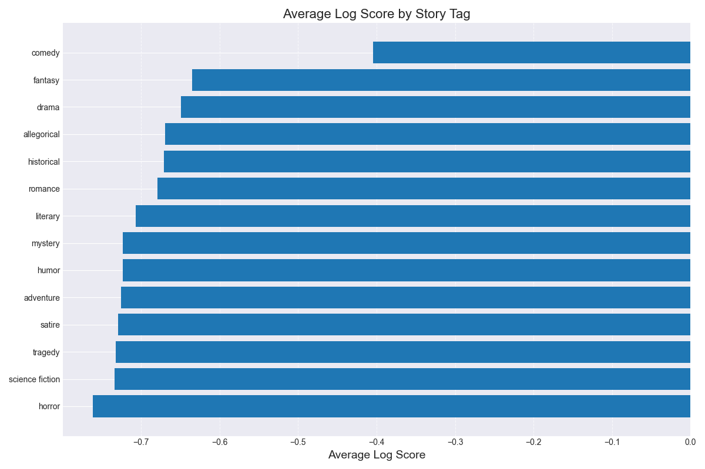
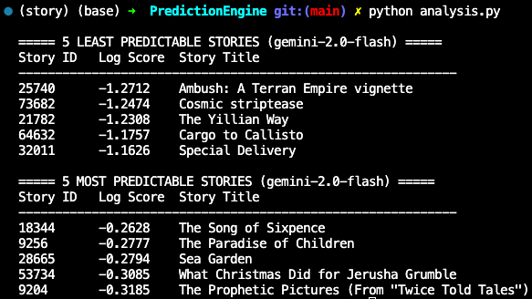
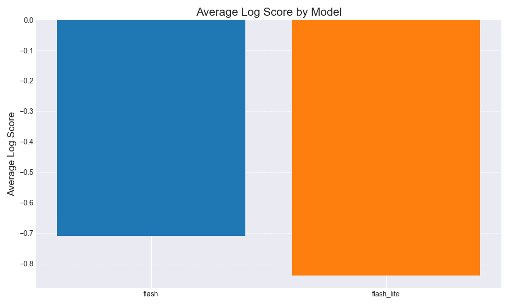

# Story Predictor

"Are some types of stories more predictable than others? And what are some of the most and least predictable stories out there?" We all sometimes have the sense, halfway through a movie or book, that some plot outcomes appear all but guaranteed by the setup of the story. If a character makes a comment about their grandfather's prized gun sitting on the mantle at the beginning of the story, it's a sure bet that someone will be shooting that gun at some zombies before the end. However, people don't really systematically score these predictions. Now that LLMs are passable at reading comprehension, I figured we could do something empirically satisfying.

The process I followed:

1. Scrape thousands of short stories from Project Gutenberg
2. Tag and filter stories by genre and criteria (440 in the final set)
3. Operationalize forecasting questions at the halfway point of each story
4. Resolve the ground-truth answers for each question in light of the full story
5. Elicit LLM forecasts on each question from the halfway point
6. Score model forecasts against the ground-truth answers

I found the operationalization step to be the most philosophically interesting question of the project: what types of questions should the LLMs try to forecast, and how? On the one hand, the easiest questions to grade are those about the plot, and it is easiest to frame useful questions about the plot after having read the story. On the other hand, such questions themselves can give away information! I settled on two design choices: LLMs should formulate questions using the same amount of information as the LLM forecaster (only seeing the first half of the story), and the questions should mix plot points with questions pertaining to relationships between characters, setting and time, and the themes and symbolism of the work. You can see the prompt in `create_questions.py`.

On the results: I wasn't too surprised that comedy was the most predictable genre, but I had expected mystery to be the least, and I was also surprised by how relatively unpredictable satire was. I'm not sure why I even chose to make "comedy" and "humor" two different tags, but I was surprised that they differed a lot in predictability.

In the least predictable story from my dataset, "Ambush: A Terran Empire Vignette," Gemini-2.0-Flash on average only placed a 28% on the correct outcome for each question posed to it by the middle of the story. Meanwhile, the LLM absolutely clocked "The Song of Sixpence," assigning on average 77% probability to the correct outcome for each question posed to it. Here are the top and bottom 5 for your interest:

It was also good to confirm that Gemini-2.0-Flash is better at predicting stories than the lite version of the model.
